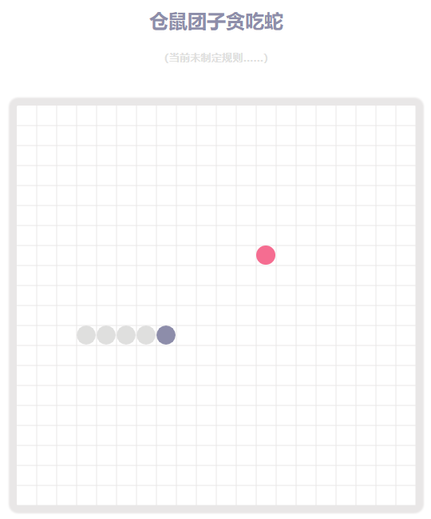

# 基于Canvas实现的贪吃蛇
## 安装依赖以及运行
```js
npm install
npm start
```
## 说明
暂停游戏-空格
游戏继续与移动-方向键
> 注：此项目仅一时兴起，用于促进自己对canvas编程的掌握



## 实现方式的启发记录
自己陆陆续续通过使用canvas实现了贪吃蛇的基础功能，进一步熟悉了canvas的api应用，同时也是重新捡起自己以前的思维逻辑能力（说实话比起刚毕业下降了好多= =，但是实现方式与各种细节比以前好多了），一边实现一边记录自己的想法，做笔记的同时也可以为看到的人提供代码实现的思路。
### 对模块的划分
模块的划分与数据模型的建立是耗时比较久的部分了，想起以前，一个项目一个文件就可以写到底，当时甚至觉得完全没有分文件的必要（笑死，解耦是什么，能吃么）。
未完待续...
### 数据模型思考-蛇、食物
模型的建立首当其冲的就是直观、容易理解和易于维护。
未完待续...
### 游戏行为控制-移动、食物捕获、增长
这部分实际上就是对模型的操控了，更新数据然后引起画布重绘。
未完待续...
### 游戏渲染器实现细节
游戏的绘制统一在一个自定义的方格渲染器内进行实现。
未完待续...